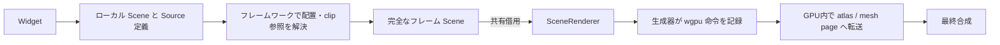
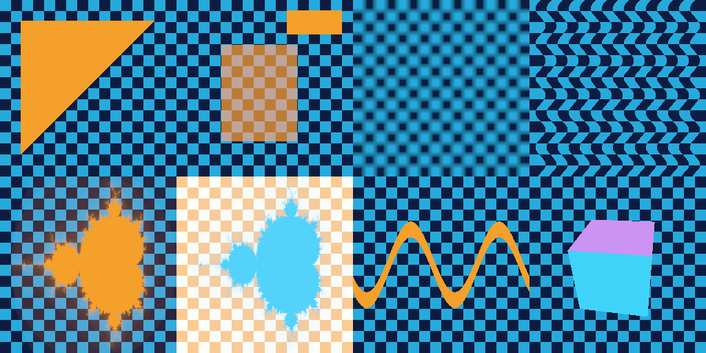
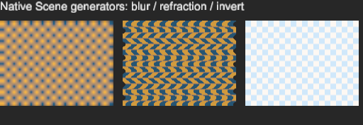

# Native Scene 実装とレンダリングインターフェースのストレス検証

## 今回の結論

**`matcha-paint` と RenderNode / Bitmap 変換経路を廃止し、標準ウィジェットが Scene と
GPU 生成定義を直接提供する構成に変更した。レンダラにはテクスチャアトラスとメッシュの共有配置を実装した。**

そのうえで、単に表示するデモではなく、共有・再生成・移動・失敗・背景依存を実際に起こして検証した。
現契約で、描画順、マスク、任意 GPU 生成、再生成可能な内容 ID、配置の隠蔽は成立する。
一方、**snapshot に依存する内容 ID の作り方、CPU 成功と GPU 検証の区別、サンプリングの意味**は、
今後のインターフェース設計へ明示的に返すべき点だった。

作業は引き続き `codex/render-interface` 内。前回コミット `0088c26` を改めたもの。
main と他の既存ブランチの先端は変更せず、GitHub 操作は行っていない。
前回の [報告書](render-interface-report.md) は過去の実験記録として残し、現在の構成は本書を参照する。

## 1. UI とフレームワークの変更



`RenderItem` は `Scene` を直接キャッシュする。ウィジェット内部の別の描画木は保持しない。
`append_scene` は Object / PixelMask の配列を結合し、その時点で変換とマスクインデックスを解決する。
複数のローカル Scene に入っている共有 Source は、最終 ResourcePool では一つにまとめる。

| 入口 | 使用方法 |
|---|---|
| `RenderItem::new` | 変更時に native Scene を作り直し、それまでは保持する |
| `RenderItem::dynamic` | 描画のたびに、保持している Scene を直接更新する。配列容量や静的 Source を再利用できる |
| `RenderCtx.transform` / `viewport_size` | 画面全体の snapshot から、自分の背景領域を読むための解決済み情報 |
| `ClipReset` | 祖先の clip を抜ける。描画抽出と picking の双方に適用する |

dynamic は次の redraw を自動予約しない。アニメーションのスケジューリングは既存の UI 側の仕事。
また、ClipReset は位置や ZIndex を変えない。任意の Scene Phase を使う場合の入力順は別途整合させる必要がある。

共有のため、Source の生成クロージャを **`Box<Prepare>` から `Arc<Prepare>` に置き換えた**。
Source 自体をさらに Arc で包む構造にはしていない。別々にキャッシュするウィジェット Scene が
同じ生成定義を持てるようにする変更であり、レンダラへの所有権移譲のためではない。
既存のプールエントリを再利用する時は、新しい Source clone を行わない。

途中では同一 ID の共有にクロージャのポインタ一致を要求したが、これは棄却した。
**内容 ID の意味は論理内容であり、CPU 関数オブジェクトのアドレスではない。**
現在は descriptor の不整合を検出し、生成内容が同じという保証は従来どおり生成側が担う。
通常の `insert_*` による同一プールへの重複登録は、引き続きエラーになる。

## 2. 標準ウィジェットの生成経路

| 表現 | 実装 |
|---|---|
| 単色 | TextureSource 内で wgpu の attachment clear を記録 |
| 角丸・非対称の枠 | MaskSource 内で SDF を GPU 描画 |
| ぼかし影 | 生成器内部で六パスの分離可能フィルタを実行 |
| Text / fontdue | CPU で寸法を取得し、GPU 常駐が必要になった時に MaskSource 内でラスタライズ・転送 |
| RichText / swash | ラスタライズが寸法と画素を同時に返すため、MaskSource がその画素を保持して再転送 |
| Image | デコード・サイズ調整した画素を TextureSource が保持。共通 Bitmap 中間型は使わない |

文字や画像の CPU 処理まで一律 GPU 化した、という意味ではない。**生成方式をウィジェットの Source に戻し、
GPU で作れるものはそのまま GPU で作る**構成にした。Source は独自のパイプラインや一時資源を持てる。
最終資源の配置・常駐はレンダラが所有する。

## 3. レンダラの資源管理

テクスチャは形式別のページに配置する。既定ページは 1024×1024。ページより大きい画像は
大きなページに収容し、暗黙に縮小しない。頂点とインデックスは既定 256 KiB の共有バッファへ配置する。
描画時に ID を配置へ解決し、テクスチャの UV 範囲とバッファ範囲を設定する。

生成器には引き続き、原点・オフセットがゼロの独立した論理出力を貸す。
生成後、同じ encoder にアトラス／共有バッファへのコピーを記録する。CPU readback は挟まない。
この分離によって、生成器は通常の Clear / Render / Compute を使える。

ただし論理出力は「毎回新規確保した物理資源」とは限らない。同じ descriptor の一時出力を、コピー記録後に
次の生成器へ貸せるようにした。同時に貸す頂点・インデックス出力は、サイズと usage が一致しても別の資源にする。
各生成器が全内容を初期化し、出力先の識別子・過去の内容を持ち越さない契約がここで効いている。

GPU キャッシュの追い出しで配置の lease を解放し、空になったページは解放する。
再利用先への書き込みは、以前の描画より後の Queue 順序で実行する。
`compact_resources` は、生成器を呼び直さず GPU コピーだけで既存内容を移動する。
したがって、背景依存で生成した画像も別の snapshot で再解釈されない。

## 4. 実際に検証した表現と条件

| ケース | 確認内容 |
|---|---|
| 角丸・枠・影 | 五つの GPU 生成結果を独立した CPU 実装と比較 |
| 共有背景 | 独立した三つのウィジェット Scene が一つの Source を共有し、GPU 生成は一回 |
| ブラー・屈折・反転 | 通常の Widget → layout → extract → Scene という経路で動作 |
| 配置された backdrop | 三番目のウィジェットの反転結果を、その位置の背景の CPU 計算と比較 |
| Phase | 同じ Phase 内の先行 Object を生成器が読み込まないこと、初回参照の入力を保つこと |
| 任意メッシュ | indexed triangle と、Compute 生成の 1,536 頂点の変形リボン |
| 複数／任意形状マスク | 三角形、フラクタル、透視変換、十段の祖先、2 倍の物理解像度 |
| 私的な 3D 描画 | 独自の頂点 ABI・カメラ・深度バッファで cube を生成し、UI の色画像として合成 |
| 小アトラス | 16 texel のページで複数ページ、隣接領域、大きすぎる画像を強制 |
| メッシュ配置 | 小バッファでページを増やし、異なるメッシュ・インデックスを描画 |
| 再配置 | 生成回数・ID を変えずに移動し、移動前後の画素一致を確認 |
| 追い出し・再利用 | 半分の資源を退役して領域を再利用し、生きている資源が壊れないことを確認 |
| 失敗 | PrepareError で未 submit 資源を取り消し、再試行できること |
| CPU 合成失敗の反復 | 不正フラグメントを二十回提出しても CPU 定義が蓄積せず、修正後に同じ画像へ戻ること |
| popup | ClipReset で描画と picking の祖先 clip が一緒に外れること |
| 既存 GUI | 前回の画像と 1000×900、90 万画素を数値比較 |



左上から、メッシュ、マスクとポップアップ、ブラー、屈折、フラクタルマスク、最終加工、変形メッシュ、私的な深度付き 3D。



これは独立した Widget の native Scene を結合した画面。背景を読む際の最終配置も検証している。

## 5. 設計へ返せる知見

### 成立した点：内容 ID と物理配置の分離

GPU 内の配置を変えても Object / PixelMask / Source の ID は一切変更する必要がなかった。
背景依存画像も、再生成ではなくコピーで移せば内容を保てる。
この分離はそのまま維持する価値がある。

### 成立した点：論理 snapshot は、必ずしも画像コピーではない

全生成器の読み取り命令を Phase の描画命令より前に記録すると、累積画像自身を入力に使える。
GPU 命令の順序が意味を保つため、画面全体のコピーと別の snapshot attachment を削除できた。
生成器内部のマルチパスも、その専用出力を作る範囲なら Phase を増やす必要がない。

現在の作業画像は RGBA16Float 一枚＋R8 六枚で、約 **14 bytes × viewport pixels**。
生成を後の時点まで遅延する実装へ変更する場合は、初回 Phase の意味を守る方法を再検討する必要がある。

### 要改善：snapshot 依存を内容 ID に反映する責任が見えにくい

負のテストで、背景を赤から青へ変更し、コピーする Source の ID だけ据え置いた。
warm cache では赤が残り、cache clear 後は青になった。新しい ID を作ると一致した。

これは現契約の矛盾ではなく、生成側が「同じ ID は同じ内容」を破った例。
しかし Source の型だけでは、暗黙の snapshot 依存を検査できない。
今回の UI では dynamic Scene writer によって、安全側に新しい ID を作る経路を用意した。

設計候補としては、snapshot の版を明示的な生成入力として扱う補助 API が考えられる。
ただし **生成レシピの ID と、生成結果の内容 ID を同じ意味にしてしまわないこと**が重要。
レンダラが黙って同じ ID を別内容へ更新する変更は行っていない。

### 要改善：CPU の Ok と GPU 検証成功は別

意図的に不正な形式変換 Copy を記録した生成器は `Ok` を返し、現在の `render` も `Ok` を返した。
一方で wgpu の error scope は検証エラーを返した。

現在の Result は CPU 構造検証／PrepareError の経路であり、GPU 検証・完了の保証ではない。
ただし、これは検証に GPU 実行完了待ちが必要という意味ではない。追加確認した native wgpu 29 では、
この Copy の形式検証は `encoder.finish()` 内で同期的に実行され、error scope または handler に届く。
`copy_texture_to_texture` は `()`、`finish` は CommandBuffer を返し、検証失敗を Result で返さない。
今回の実装がその別経路を SceneError へ接続していないことが、CPU の Ok と食い違う直接の理由。
先の「submission receipt や非同期エラー観測口が必要」という提案は、検証と実行完了を混同していたため撤回する。
エラーの扱いはまず renderer の責任として整理し、インターフェース本体の変更要否は別途判断する。

### 要判断：サンプリングは配置最適化ではなく描画の意味

二画素の画像を拡大すると、現在の固定 linear sampler は境界を混色する。
同じ TextureId のまま texel ごとに一定 UV の quad を作れば pixel art の見た目を再現できたが、
一 texel あたり六頂点が必要になる。

効率よく nearest / linear を選ぶには、描画側の意味として選択肢を設けるのが自然。
アトラス実装の内部都合として切り替えるべきではない。今回は比較と回避実装まで確認し、
Object 等への sampler-policy フィールド追加は今後の判断として残した。

### 要判断：独立したローカル Scene の合成方法

複数ウィジェットの資源共有には、CPU 定義の所有者をどう共有するかが必要だった。
今回の Arc<Prepare> は単一割り当てを共有しやすい一案。中央の定義レジストリや借用された
資源ビューにまとめる設計なら、別の所有構造にもできる。

また、幾何の変換だけを後から掛けても、生成クロージャが捕捉した背景座標は書き換えられない。
そのため、背景依存 Source の構築時に解決済み配置を渡した。
「どこへ置くかに依存しない共有資源」と「配置された場所の背景に依存する資源」を区別する必要がある。

### 実装知見：ページ数・論理内容量・ページ容量は別の指標

あるストレスケースでは、再配置によって texture page が **7 → 2**、mesh page が **16 → 1** になった。
しかし texture page の texel 容量は **46,468 → 196,608 bytes** に増えた。
逆に native widget のケースでは、小さなページへ詰め直すことでページ数が増え、容量が減った。

ページ数削減、メモリ削減、bind group 削減は同じ目的関数ではない。
また、これらの容量はドライバの実 VRAM 割り当て量ではない。
デフォルトの cache budget も論理内容量に対する soft budget のままで、hard VRAM 上限ではない。

### 実装知見：ID の上流にあるキャッシュにも寿命が必要

画像キャッシュの既存の pointer / length キーが入力の寿命を保持していなかった。
アドレス再利用で別画像を同一キーと扱える構造だったため、弱い入力所有を保持して死んだ入力を除去するようにした。
内容 ID を正しく設計しても、その前段で別の内容を同一扱いすれば保証は崩れる。

## 6. 検証と再現

実 GPU は AMD Radeon RX 5700 XT。契約テストと native widget stress を Vulkan / DirectX 12 の両方で実行する。
通常のワークスペーステストに加え、例のプログラム自体に readback・比較・生成回数の assertion がある。
意図的な契約違反の診断は、正しい入力の GPU 検証と区別して記録している。

最終集計は **457 成功 / 0 失敗 / 既存 ignored 8**。全 workspace examples のビルドも成功した。
GPU 生成の五つの形状比較は両バックエンドで最大差 0。既存 GUI の release 出力も、前回画像と
**900,000 / 900,000 画素一致**だった。

| 最終 showcase 計測 | 結果 |
|---|---|
| 最初のフレーム | 約 247 ms（CPU 組み立て・文字処理等を含む） |
| 続く三フレーム | 約 4.11 / 3.03 / 3.03 ms、GPU 完了待ち込み |
| warm frame の Scene 組み立て | 約 126〜132 µs |
| 描画 | 1,038 draw、7 draw-containing RenderPass、bind group 8 |
| resident 配置 | texture page 3、mesh page 1 |
| cold の論理出力確保 | texture 119、buffer 1、準備した資源 407 |
| warm の生成・出力確保・snapshot copy | すべて 0 |

7 バッチは 7 draw call の意味ではない。確保回数はバックエンドの論理出力についての計数で、
生成器内部の私的な資源やドライバの割り当ては含まない。

```powershell
cargo test --workspace --exclude shared-buffer --offline -j 2
cargo build --workspace --examples --offline -j 2
cargo test -p renderer --test scene_contract --offline -j 2 -- --nocapture --test-threads=1
cargo run -p matcha-ecs --example interface_stress --offline -j 2 -- target/native-vulkan
$env:MATCHA_TEST_BACKEND='dx12'
cargo test -p renderer --test scene_contract --offline -j 2 -- --nocapture --test-threads=1
cargo run -p matcha-ecs --example interface_stress --offline -j 2 -- target/native-dx12
Remove-Item Env:MATCHA_TEST_BACKEND
cargo run -p renderer --example scene_gallery --offline -j 2 -- target/native-gallery
cargo run -p matcha-ecs --example showcase --release --offline -j 2 -- --offscreen target/showcase-native-release.png
cargo run -p renderer --example image_diff --offline -j 2 -- docs/render-interface/showcase-scene.png target/showcase-native-release.png
```

既存の Suzuri パス依存と showcase の画像アセットが必要。今回、新たなダウンロードや GitHub 操作はしていない。
最新の集計・GPU 出力・計測は [validation.txt](native-render-interface/validation.txt) に保存する。

release の計測は CPU の Scene 組み立て、encode/submit、完了待ちを分けている。
debug の大きな処理時間から GPU 性能を推測しない。今回のローカルな warm frame 計測と、
旧実装との release 性能比較は別であり、後者は行っていない。

## 検証の限界

- 内容同一性や正しい GPU 命令を自動証明するものではない。負のテストは、その責任境界を示す。
- 個別 Source 内の私的な深度・マルチパスは動くが、Scene をまたぐ G-buffer や ResourceId による生成依存グラフは追加していない。
- GPU 生成メッシュは固定 capacity / draw count。GPU で変動する indirect count は未実装。
- texture atlas は単一 mip / layer の現在の契約向け。フィルタは linear、最終合成は premultiplied source-over。
- フレーム内の出力再利用はあるが、CPU upload staging の全体一括化、全面的な bindless / indirect draw 化は行っていない。
- ブラウザ、実 IME・連続リサイズ、device-loss 復旧は今回の検証に含めない。main に matcha-web は存在しない。

報告後の判断・検証タイミングの追加実験・ローカル Scene 合成の詳細は
[render-interface-review-notes.md](render-interface-review-notes.md) を参照。
