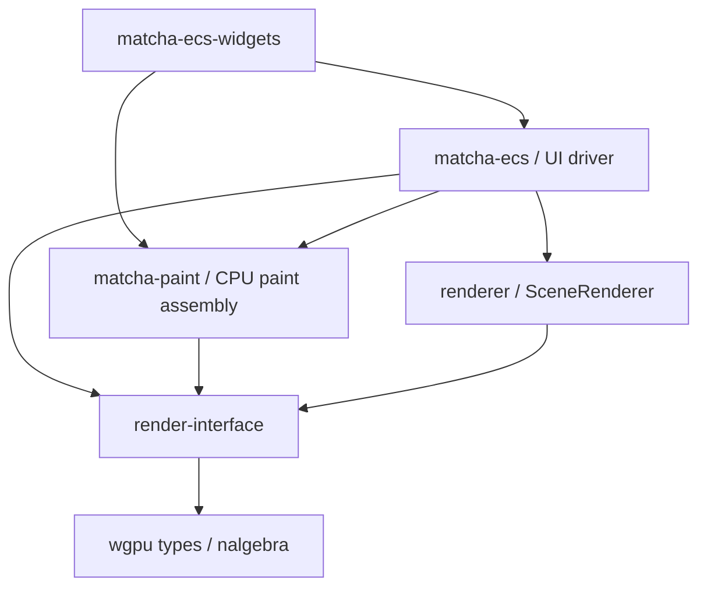
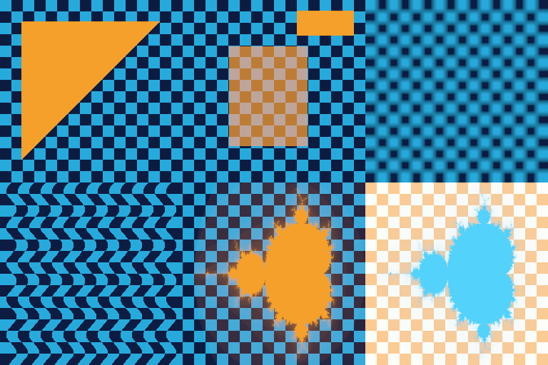
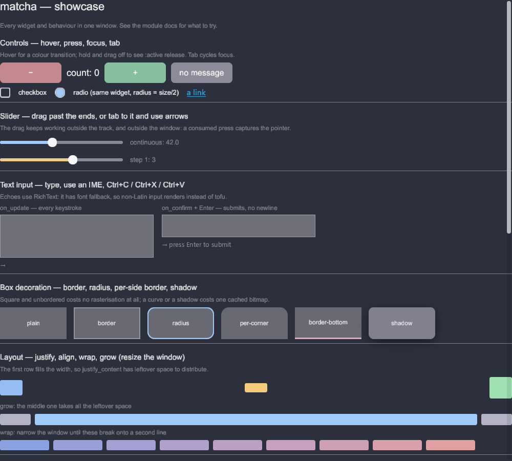

# レンダリングインターフェース更新・実装報告

## 結果

参照チャット「レンダラ連携調査」の最終合意に沿って、**UI が所有する完全な Scene を
`&Scene` で借用し、レンダラが GPU 資源・キャッシュ・最終合成を所有する構成**へ移行した。
定義だけの追加ではなく、現在の ECS GUI と全既存ウィジェットの最終描画経路で使用している。

作業ブランチは `codex/render-interface`。起点は main の
`a7fd3f6c58fad19934231b52ee356828ef42ebba`。既存ブランチの先端は変更せず、GitHub 操作も行っていない。

## 依存関係と責務

矢印は依存する方向。



| 層 | 所有するもの | 所有しないもの |
|---|---|---|
| `render-interface` | Scene / Phase / Object / PixelMask、内容 ID、生成定義・出力 Context の契約 | ECS、ウィジェット、GPU キャッシュ実装 |
| `matcha-paint` | 不変 CPU Bitmap、UI 内の描画木、Scene の組み立て・再利用 | GPU アトラス、GPU デバイス、最終描画 |
| `matcha-ecs` | レイアウト・入力状態の抽出、SceneBuilder、ウィンドウ・present の調停 | 資源配置ポリシー |
| `SceneRenderer` | GPU バッファ・テクスチャ、生成タイミング、Phase の画像、マスク評価、合成・submit | UI ツリー、ウィジェットの意味 |

`matcha-ecs-widgets` から `renderer` / `gpu-utils` / `wgpu` の直接依存を削除した。
上流定義は Matcha の実装クレートに依存しない。wgpu 自体への依存は、合意にある生の GPU
記録 Context を提供するために残る。既存の tree スタックと旧 `CoreRenderer` は参照・互換用に保持した。

## 合意との対応

| 合意 | 実装 |
|---|---|
| Scene の同期的な共有借用 | `Renderer::render` / `SceneRenderer::render(&Scene, SceneTarget)`。CPU コールバックは復帰前に完了 |
| Scene / 生成定義の再利用 | UI 側に永続 SceneBuilder。Source は HashMap に直接保持し、Source ごとの Arc は追加しない |
| 同じ ID は同じ内容 | 型別 ID、桁あふれ検出付き発行、変更可能な Source フィールドを非公開化 |
| 一つのプールに一つの定義 | `insert_*` が Source 自身の ID を使用。重複はエラーで、既存定義を置換しない |
| 資源は登録だけで生成しない | Object / 使用マスクの祖先から要求された時だけ準備する |
| キャッシュがなくても自己完結 | 毎回参照定義を検査。温まったキャッシュがあっても定義不足を拒否 |
| Phase 順、Object 配列順 | 提出順で source-over 合成。UI 木順やマスク木順による暗黙の並べ替えなし |
| 独立したマスク木 | 親は先行インデックス。Object は末端を指定し、被覆のみを乗算継承 |
| 初回参照 Phase の入力画像 | Phase 開始時の凍結画像を生成器へ渡す。同じ Phase の先行 Object は含まない |
| GPU 操作は生成専用 | 専用出力への Copy / Compute / Render を記録。最終合成と submit はバックエンド |
| GPU 配置は内部事項 | 今回は専用バッファ・テクスチャをキャッシュ。UI に配置・アトラス領域を公開しない |

`Bitmap` の CPU バイト列は UI キャッシュ間で Arc 共有する。これは Source の共有所有ではなく、
画像データの重複コピーを避けるためのもの。GPU の追い出しでも CPU の文字・形状キャッシュは壊れない。
ThreadDriver は維持し、UI 側の組み立て状態とバックエンドを一つのドライバロックで調停する。
GPU の処理完了を待ってから Scene を返す契約にはしていない。

## 未定義だった部分の具体化

- 頂点は `position: Float32x3` と `uv: Float32x2` の一ストリーム。三角形リスト、任意の u32 インデックス。
  任意バイト配置だけを公開して属性の意味が未定義になることを避けた。
- 変換はローカルから UI 座標への Matrix4。Y-down。透視補間を保持し、深度テストは行わない。
- 色は premultiplied linear RGBA。sRGB テクスチャには、その RGB を sRGB 符号化して格納する。
  opacity と被覆は四チャネルすべてに掛ける。画像ウィジェットの straight-alpha 転送もこの機会に修正した。
- テクスチャは単一 2D / mip / layer / sample。主な生成形式は R8Unorm、RGBA8Unorm、RGBA8UnormSrgb、RGBA16Float。
- 同一マスク内の重複三角形は最大被覆、親子間は被覆の積。板ポリ以外のマスクも実際にラスタライズする。
- 出力 Context は専用の論理資源を貸す。ゼロコピーやアトラスへの直接生成は保証しない。
- `bounds` と `non_overlapping` を任意の保守的な幾何情報として追加した。未指定なら一般経路を使う。
  狭すぎる bounds や虚偽の non-overlapping 指定は契約違反になる。

`RenderNode::custom` から完成 Scene に独自 MeshSource / TextureSource / MaskSource / Phase を追加できる。
したがって、新しい表現は別アプリ専用 API に隔離されず、通常の RenderItem 経由で GUI に組み込める。
描画 Phase とポインタの picking 順を連動させるかは UI の方針であり、この描画 API は picking を変更しない。

## 概念実証と動作確認

`renderer/tests/scene_contract.rs` は NOOP に逃げず、実 GPU の readback 画素と生成回数を検査する。
検証 GPU は AMD Radeon RX 5700 XT。Vulkan と DirectX 12 の両方で成功した。

| 対象 | 確認したこと |
|---|---|
| 任意メッシュ | CPU 転送した indexed triangle と Compute で生成した頂点から描画できる |
| 任意メッシュのマスク | 三角形の描画と、同じ三角形をマスクにした矩形の画素が一致 |
| 複数マスク | 交差領域で被覆が積になり、領域外では描かれない。UI と物理ピクセルが 2 倍でも一致 |
| 深いマスク | 10 段の祖先。4 段の共通 prefix キャッシュを超える ping-pong 経路を確認 |
| 透視変換・opacity | coincident mask の最適化と一般経路を比較し、差は最大 1 階調 |
| ポップアップ | 後の Phase で、親 UI の clip を選ばずに前面へ描ける |
| Phase の画像参照 | 同一 Phase の途中描画を読まない。後続 Phase でも同 ID を再生成しない |
| ブラー・屈折 | 前 Phase の画像を読む Compute 生成テクスチャを合成 |
| 手続き的マスク | Compute で Mandelbrot の被覆を生成して使用 |
| 最終画像加工 | 累積画像を反転するテクスチャを生成し、画面全体の板ポリとして最終合成 |
| Render による生成 | コールバック内の RenderPass が専用テクスチャを生成し、通常の Object として使用 |
| 初期画像 | 明示した入力画像を Phase 0 より前に合成。暗黙の前フレーム履歴に依存しない |
| キャッシュ | warm frame は生成ゼロ。明示クリア・予算による追い出し後は再生成。未使用登録は生成しない |
| 不正入力 | 重複登録、定義不足、循環する親リンク等を拒否 |
| 失敗からの再試行 | コールバック失敗では出力画素を変更しない。未 submit の新資源も取り消し、次回正常に再生成 |
| 旧実装との比較 | 旧 CoreRenderer と 4,096 画素を比較。coverage gradient・clip・opacity を含め、差 0 |

旧実装の比較対象ファイルは main 起点から無変更である。新規ケースだけの自己比較にはしていない。
ただし、4,096 画素の比較は限定ケースであり、全シーンの旧実装との一致を証明するものではない。



左上から、Compute メッシュ、ネストマスクと前面ポップアップ、ブラー、屈折、フラクタルマスク、最終画像加工。



これは `showcase` の view → layout → extract → RenderItem → Scene → GPU という実経路の出力。
通常のウィンドウ起動も 10 秒間エラーなく生存することを確認し、テスト用プロセスを終了した。
クリック・IME・手動リサイズ操作を実施したという意味ではない。

## 試行で発見した問題と改善

### 小さな GPU テストだけでは規模の問題が見えなかった

初版は専用 GPU 資源、画面サイズのマスク作業画像、描画ごとのバッファと RenderPass で実装した。
少数 Object の画素テストは通ったが、実 showcase では 2,015 Object / 4,274 mask pass になり、
Vulkan の Queue::submit が OutOfMemory になった。キャッシュの論理データ量は約 0.6 MB に過ぎなかった。
この数字だけから実 VRAM 使用量を判断してはいけない。

改善は以下の組み合わせである。

1. パラメータを一つの動的 uniform arena にまとめ、GPU バッファと CPU 領域をフレーム間で再利用する。
2. 保守的な境界で画面外を除外し、マスクの clear と描画を必要領域へ絞る。
3. マスク木の共通祖先を再利用し、深い部分は二つの画像で交互に処理する。
4. 文字等の「Object と同じ非重複メッシュ・同じ変換」の self mask は UV で直接参照する。
5. 同じ attachment に連続して描く命令を一つの RenderPass にまとめる。

uniform arena と部分 clear だけの中間版はまだ失敗した。どのドライバ内部割り当てが原因かは
分離できていないため、単一原因を断定しない。最終版では画像出力に成功し、画面内の 1,038 描画に対し
独立した mask pass は 3 件、描画バッチは 7 件、warm frame の新規資源生成は 0 件になった。
最終確認では cold frame 約 4.83 秒、warm frame 約 100 ms だった（cold は文字等の CPU 生成も含む）。
debug ビルド、ドライバ検証有効、GPU 完了待ちを含む計測であり、製品性能の保証・ベンチマークではない。warm frame も最適化余地が大きく、60 fps 達成は主張しない。

### GPU 記録の失敗とキャッシュ登録を一体で扱う必要があった

先に生成が成功した資源でも、その後のコールバックが失敗すれば、同じ command buffer は submit されない。
この資源をキャッシュ済みとして残すと、再試行時に未生成データを描く。内部の作成フレーム印で
新規エントリを取り消すようにした。外部の内容 ID に世代を導入したわけではない。

## 再現手順

リポジトリの既存依存が利用できる環境で実行する。今回の実行はすべて `--offline`、`-j 2`。
Rust 1.98.0 / wgpu 29.0.4 を使用した。既存の `../../Suzuri` パス依存と、showcase が参照する
`matcha/src/assets/videoframe_21710.png` がローカルに必要。これらを新たにダウンロード・変更してはいない。

```powershell
cargo test --workspace --exclude shared-buffer --offline -j 2
cargo build --workspace --examples --offline -j 2
cargo test -p renderer --test scene_contract --offline -j 2 -- --nocapture --test-threads=1
$env:MATCHA_TEST_BACKEND='dx12'
cargo test -p renderer --test scene_contract --offline -j 2 -- --nocapture --test-threads=1
Remove-Item Env:MATCHA_TEST_BACKEND
cargo run -p renderer --example scene_gallery --offline -j 2 -- target
cargo run -p matcha-ecs --example showcase --offline -j 2 -- --offscreen target/showcase-scene.png
```

ワークスペーステストは **448 成功 / 0 失敗 / 8 ignored**。
`shared-buffer` の除外と既存 ignored は従来の規約・テスト状態による。全 examples のビルドも成功した。
現在の main には `matcha-web` が存在しないため、wasm / ブラウザでの動作確認は行っていない。

## 残る制約と次に改善できる点

- 今回は表現力と所有境界を成立させる実装。メッシュ・テクスチャの GPU atlas、bindless、indirect の
  大規模バッチ化は未実装であり、バックエンド内で追加できる。
- デフォルト 128 MiB はキャッシュの**論理内容量の soft budget**。使用中フレームは固定し、作業画像、
  ドライバの割り当て粒度、uniform、転送、一時コマンドのメモリは別。hard VRAM 上限ではない。
- RGBA16Float の色・スナップショット二枚、R8 のマスク六枚を保持するため、作業画像だけで
  おおむね 22 bytes × viewport pixels。将来は必要なマスク深度・Phase に応じた遅延確保が可能。
- 専用テクスチャ方式には小画像の GPU 管理オーバーヘッドがある。文字の atlas 化は UI の契約を変えずに改善できる。
- 背景依存の内容が変わったら新 ID が必要。同じ ID の任意クロージャが意味的に同じ内容を生成するかは
  自動検証できない。範囲・non-overlap のヒントも生成側の責任。
- 生の wgpu ハンドルを渡す生成器は信頼された拡張。誤った GPU 命令・device loss は wgpu の検証／エラーモデルに従う。
  今回の `Result` と rollback の検証は、Scene の構造エラーと `PrepareError` を対象としている。
- 深度テスト、MSAA、G-buffer、複数 attachment、前フレーム履歴、任意頂点属性 ABI は含めない。
  G-buffer 等は参照チャットでも後続の拡張として扱われていた。
- 入力・picking の新しい Phase 対応、実 IME と連続リサイズ、ブラウザ、GPU device 再作成の検証は別途必要。

詳しい契約は `render-interface/src/lib.rs`、内部判断は `renderer/src/scene_renderer.rs` のモジュール文書、
経緯と棄却した案は `.agent/journal/2026-09-23-render-interface.md` に残した。
