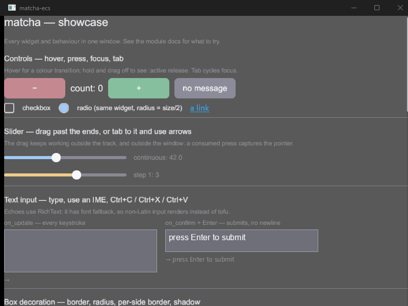

# matcha

A Rust GUI framework built on an ECS core ([`bevy_ecs`](https://crates.io/crates/bevy_ecs)),
rendering with [wgpu](https://wgpu.rs/) and windowing through
[winit](https://crates.io/crates/winit) / [baseview](https://github.com/RustAudio/baseview).
It is intended as the frontend for an open-source video editor project.

## Status

🚧 **v0.0.6 — alpha.** 🚧

The framework runs — the `showcase` example exercises the implemented feature set in one window
— but it is early software.

- **The framework architecture and the public API are expected to change, including breaking
  changes, with no deprecation period.** Widget builders, the `Scope` / `Widget` reconciliation
  model, the frame schedule, and the input and focus APIs have each been reshaped more than once
  so far.
- The crates are `publish = false`: they are not on crates.io. Use them through a path or git
  dependency, and pin an exact revision.



*The `showcase` example — `cargo run -p matcha-ecs --example showcase`.*

## How it works

```text
Model
  → view(&mut Scope, &Model)      // declare the widget tree
  → reconcile                     // diff the declaration into ECS entities
  → PreLayout                     // animation, anything layout will read
  → Layout                        // measure / arrange
  → PreExtract                    // invalidation, picking, hit data
  → Extract                       // flatten to a render snapshot
  → render thread → wgpu

pointer / key / IME
  → pick (one entity)             // then bubble, or walk the focus path
  → Msg → reducer(&mut Model)     // then re-run view
```

The application owns a plain `Model` and a `reduce(&mut Model, Msg)` function. `view` is called
with a `Scope` and declares widgets into it; the reconciler diffs that declaration against the
existing entities, keeping the ones whose widget type and key match and patching them in place.
Everything after that is ECS systems running in a fixed set of schedule stages. Two of those
stages — `PreLayout` and `PreExtract` — are open: applications and widget crates register their
own systems into them via `UiEcs::with_pre_layout_systems` and `with_pre_extract_systems`.

## Workspace

| Crate | Role |
|---|---|
| `matcha-ecs` | Framework core: reconciliation, layout, picking, focus, keyboard and IME, clipping, the render pipeline, tasks. |
| `matcha-ecs-widgets` | Widget implementations and their layout, animation and interaction systems. Depends on the core; never the reverse. |
| `matcha-window` | Windowing abstraction over winit and baseview, plus a headless backend for tests. |
| `renderer` | The wgpu render pipeline: instances, mask chains, atlas sampling. |
| `gpu-utils` | GPU context and texture atlas allocation. |
| `glyph-cache` | Generic fixed-capacity LRU cache with per-batch eviction protection. |
| `shared-buffer`, `utils` | Shared helpers. |

`matcha`, `matcha-tree` and `matcha-tree-widgets` are the earlier implementation of this
framework, superseded by the crates above and kept for reference.

## Usage

```rust
use matcha_ecs::{ui_ecs::UiEcs, view::Scope};
use matcha_ecs_widgets::{AlignItems, Button, Column, Length, Row, Text};
use matcha_window::adapter::Adapter;

struct Model {
    count: i32,
}

#[derive(Clone)]
enum Msg {
    Inc,
    Dec,
}

fn reduce(model: &mut Model, msg: Msg) {
    match msg {
        Msg::Inc => model.count += 1,
        Msg::Dec => model.count -= 1,
    }
}

fn view(s: &mut Scope, model: &Model) {
    s.node(Column::new().gap(12.0).width(Length::Fill), |s| {
        s.leaf(Text::new("counter").font_size(20.0));
        s.node(Row::new().gap(10.0).align_items(AlignItems::Center), |s| {
            s.leaf(Button::new("−").on(Msg::Dec));
            s.leaf(Text::new(format!("count: {}", model.count)).font_size(18.0));
            s.leaf(Button::new("+").on(Msg::Inc));
        });
    });
}

fn main() {
    Adapter::new(
        UiEcs::new(Model { count: 0 }, view, reduce)
            .with_pre_layout_systems(matcha_ecs_widgets::default_systems()),
    )
    .run()
    .expect("event loop failed");
}
```

`matcha_ecs_widgets::default_systems()` registers the systems the widgets need. Without it, exit
fades never despawn, text boxes never re-lay-out, carets never blink, and colour transitions
never advance. Each widget module also exposes its own `default_systems()` for registering only
part of the set.

## Implemented

**Framework**

- Layout: `Container` / `Column` / `Row` with gap, wrapping, `justify-content` and `align-items`;
  `Length` sizing (px, percent, auto, fill) with min, max and aspect ratio.
- `display: none`, covering layout, drawing and picking.
- Picking; focus, including `:focus-within`, focus claiming and last-focused restore; and
  document-order tab stops.
- Keyboard and IME delivery down the focus path, clipboard, cursor shapes.
- Pointer press, drag and scroll, with implicit pointer capture on press, so a drag continues
  outside the window.
- Clipping (`overflow: hidden`) via GPU mask chains, and scrolling with scroll chaining.
- Hover and active states with colour transitions; enter and exit fade animations.
- Async tasks bound to a UI entity's lifetime (`matcha_ecs::task::spawn_task`).
- Rendering on a thread separate from the UI thread, with per-window snapshots.
- Headless testing: a wgpu NOOP backend and a headless window backend run the full app driver,
  input included, with no GPU and no OS window.

**Widgets**

`Container`, `Column`, `Row`, `Padding`, `Panel`, `Anchor`, `ScrollView`, `ColorRect`, `Text`,
`RichText`, `TextBox`, `Button`, `Checkbox`, `Slider`, `Link`, `Image`.

There are two text widgets. `RichText` is backed by [parley](https://crates.io/crates/parley) and
[swash](https://crates.io/crates/swash): shaping, font fallback, most CSS text properties,
per-span styling, underline and strikethrough. `Text` uses in-house layout (fontdue, via the
sibling `suzuri` crate) and has no font fallback, so a character the font lacks renders as tofu.

## Not implemented

`position: absolute` / `fixed` / `sticky`, CSS Grid, `transform`, inline text flow, accessibility,
undo/redo and a single-line variant for `TextBox`, smooth and inertial scrolling, and web/wasm
support.

## Platforms

Developed and tested on Windows. The winit backend covers macOS and Linux, but neither is
verified. The baseview backend is feature-gated and likewise unverified.

## Building

```bash
cargo run -p matcha-ecs --example showcase
```

```bash
cargo build --workspace --examples
```

```bash
cargo test --workspace --exclude shared-buffer
```

`shared-buffer` is excluded because its doctests fail for reasons unrelated to the framework.

## Minimum Supported Rust Version

1.89.0. The workspace uses edition 2024.

## License

Undecided.
